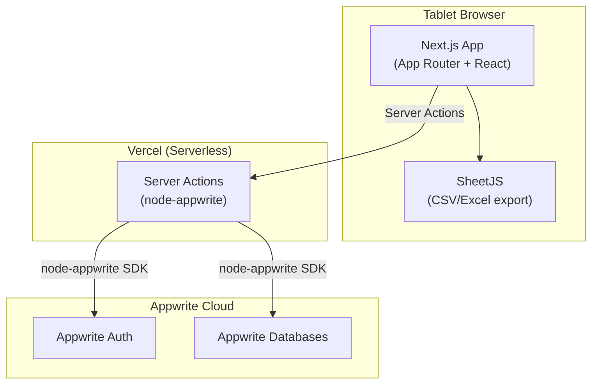
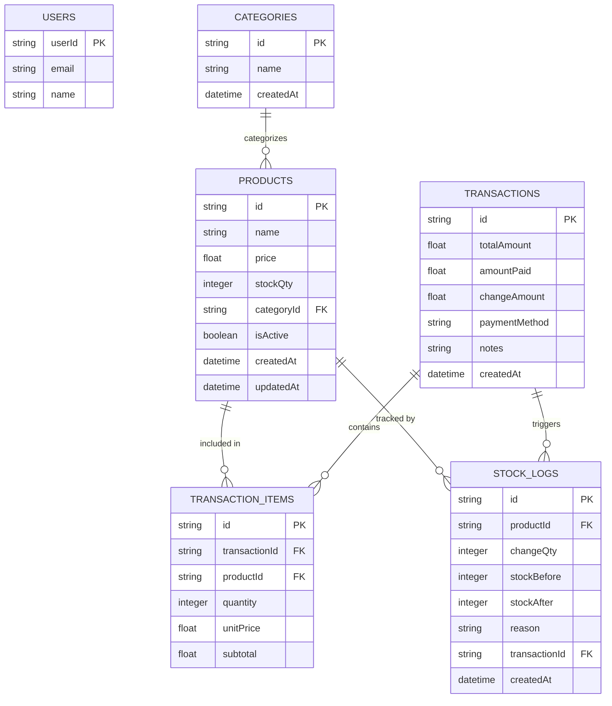

# PRD — F&B POS Web App

> **Version:** 2.1.0
> **Date:** 2026-04-04
> **Status:** MVP implemented and verified locally

---

## 1. Overview

### Problem Statement
Operasional kasir di bisnis F&B skala kecil sering masih dilakukan manual (tulis tangan / kalkulator), menyebabkan rawan kesalahan hitung, tidak ada history transaksi terstruktur, laporan penjualan sulit dibuat, dan monitoring stok tidak real-time.

### Goals
| # | Goal | Prioritas |
|---|------|-----------|
| 1 | Menggantikan proses kasir manual dengan sistem digital | Critical |
| 2 | Menyediakan history transaksi yang akurat dan dapat dicari | Critical |
| 3 | Generate laporan penjualan yang bisa di-export ke Excel/CSV | High |
| 4 | Monitoring stok secara real-time dengan audit trail | High |
| 5 | Deploy mudah ke Vercel tanpa infrastruktur tambahan | High |

### Target User
Owner bisnis F&B yang sekaligus berperan sebagai kasir — **solo operator**, 1 outlet, akses via **tablet (Android/iPad)**.

### Out of Scope (MVP)
- Payment gateway terintegrasi (Midtrans, Xendit, dll)
- Printer struk/receipt thermal
- Notifikasi push stok habis
- Multi-user / role management
- Multi-outlet
- Offline mode penuh

---

## 2. Requirements

### Functional Requirements
- **Kasir:** Proses transaksi — pilih menu → qty → hitung kembalian → pilih metode bayar (Tunai / Transfer Bank / QRIS print)
- **History Transaksi:** Tampilkan semua transaksi dengan pencarian transaksi/catatan, filter metode bayar, dan detail per transaksi
- **Laporan:** Ringkasan penjualan harian/mingguan/bulanan/kustom, exportable ke Excel/CSV
- **Manajemen Stok:** Auto-deduct saat transaksi, bisa edit manual, log perubahan stok
- **Manajemen Produk:** CRUD produk dengan nama, harga, stok awal, dan kategori opsional
- **Dashboard:** Ringkasan revenue hari ini, produk terlaris, stok kritis
- **Auth:** Login dengan email + password via Appwrite Auth

### Non-Functional Requirements
- **Koneksi:** Requires internet — data tersimpan di Appwrite Cloud
- **Responsif & touch-friendly:** Optimized untuk tablet, tombol kasir besar dan mudah di-tap
- **Performa:** Transaksi harus dapat diselesaikan dalam < 5 detik end-to-end
- **Keamanan:** Auth dan session ditangani penuh oleh Appwrite; HTTPS via Vercel (otomatis)
- **Bahasa:** Bilingual UI — Bahasa Indonesia & English (toggle)
- **Tema:** Modern minimalis dengan dukungan dark mode
- **Free tier:** Appwrite Free — 500K read ops + 250K write ops/bulan (lebih dari cukup untuk 1 outlet)

---

## 3. Core Features

| # | Fitur | Priority | Status MVP |
|---|-------|----------|------------|
| 1 | **Kasir / Checkout** — pilih produk, qty, hitung kembalian, pilih metode bayar | Must-have | ✅ MVP |
| 2 | **History Transaksi** — list semua transaksi, pencarian, filter pembayaran, detail per transaksi | Must-have | ✅ MVP |
| 3 | **Laporan & Export CSV** — ringkasan penjualan per periode, download Excel/CSV | Must-have | ✅ MVP |
| 4 | **Manajemen Stok** — auto-deduct + edit manual + stock log | Must-have | ✅ MVP |
| 5 | **Manajemen Produk** — CRUD produk (nama, harga, stok, kategori opsional) | Must-have | ✅ MVP |
| 6 | **Dashboard** — revenue hari ini, produk terlaris, stok kritis | Should-have | ✅ MVP |
| 7 | **Autentikasi** — login email + password via Appwrite Auth | Must-have | ✅ MVP |
| 8 | **Diskon / Voucher** | Nice-to-have | 🔜 Future |
| 9 | **Notifikasi stok hampir habis** | Nice-to-have | 🔜 Future |
| 10 | **Printer struk** | Nice-to-have | 🔜 Future |
| 11 | **Multi-user / role management** | Nice-to-have | 🔜 Future |

---

## 4. User Flow

### Flow 1 — Login
```
1. Buka URL app di browser tablet
2. Halaman login → input email + password
3. Appwrite Auth memvalidasi session
4. Redirect ke Dashboard
```

### Flow 2 — Transaksi Kasir (Primary Flow)
```
1. Owner buka halaman Kasir
2. Tap produk dari grid menu → masuk ke keranjang
3. Adjust qty di keranjang jika perlu
4. Sistem hitung total otomatis
5. Pilih metode bayar: Tunai / Transfer Bank / QRIS
   └── Jika Tunai: input nominal diterima → sistem hitung kembalian
6. Tap "Selesaikan Transaksi"
7. Sistem (sequential Appwrite writes):
   a. createDocument → collection transactions
   b. createDocument (per item) → collection transaction_items
   c. updateDocument → kurangi stock_qty di products
   d. createDocument → collection stock_logs (reason: "sale")
8. Tampilkan konfirmasi transaksi berhasil
9. Keranjang di-reset, siap transaksi berikutnya
```

### Flow 3 — Manajemen Stok Manual
```
1. Buka halaman Stok
2. Pilih produk
3. Input delta stok + alasan (restock, koreksi, dll)
4. Simpan → updateDocument products + createDocument stock_logs
```

### Flow 4 — Export Laporan
```
1. Buka halaman Laporan
2. Pilih rentang tanggal (harian / mingguan / custom)
3. App query Appwrite → listDocuments transactions (filter by date)
4. SheetJS generate CSV/Excel di browser
5. File didownload ke device
```

---

## 5. Architecture

### Tech Stack

| Layer | Teknologi | Alasan |
|-------|-----------|--------|
| Frontend | **Next.js 15** (App Router, React 19) | Full-stack, SSR + Server Actions |
| Backend / BaaS | **Appwrite Cloud** | Auth + Database built-in, free tier cukup untuk 1 outlet |
| Auth | **Appwrite Auth** (email + password) | Built-in, session di-manage otomatis |
| Database | **Appwrite Databases** (document-based) | Collections + query filter + realtime subscription |
| Styling | **Tailwind CSS** + custom UI primitives | Minimalis, dark mode, tablet-friendly |
| i18n | **next-intl** | Bilingual ID/EN |
| Export | **SheetJS** (client-side) | Generate CSV/Excel di browser, tidak perlu API route khusus |
| Deployment | **Vercel** | Push → deploy otomatis, TLS, zero config |

### System Architecture



### Appwrite Collections Map

| Collection | Setara Tabel Relasional | Keterangan |
|------------|------------------------|------------|
| `products` | products | Katalog menu + stok |
| `categories` | categories | Kategori produk (opsional di MVP) |
| `transactions` | transactions | Header setiap transaksi |
| `transaction_items` | transaction_items | Line item per transaksi |
| `stock_logs` | stock_logs | Audit trail perubahan stok |

> Appwrite Auth menangani `users` secara built-in — tidak perlu collection terpisah.

---

## 6. Database Schema



### Collection Details

| Collection | Field Kritis | Index |
|------------|-------------|-------|
| `products` | `isActive` (soft delete), `stockQty` | `categoryId`, `isActive` |
| `transactions` | `paymentMethod` (cash/transfer/qris), `createdAt` | `createdAt` |
| `transaction_items` | `unitPrice` snapshot saat transaksi | `transactionId`, `productId` |
| `stock_logs` | `changeQty` negatif = keluar, positif = masuk | `productId`, `createdAt` |

---

## 7. Design & Technical Constraints

### UI / UX Constraints
1. **Touch-first:** Semua elemen interaktif minimum 48×48px (touch target WCAG)
2. **Grid produk kasir:** Card-based, 2 kolom portrait, 3–4 kolom landscape
3. **Tombol aksi utama:** Tinggi minimum 56px, font 18px+, contrast ratio > 4.5:1
4. **Dark mode:** Tailwind `dark:` classes + `next-themes`
5. **Bahasa:** next-intl, locale default `id`, toggle ke `en` via settings
6. **Tablet navigation:** Persistent navigation rail on tablet/desktop, drawer on mobile only
7. **Long-content safety:** ID transaksi, nama produk, dan teks dinamis harus wrap tanpa overflow pada viewport tablet

### Technical Constraints
1. **Appwrite SDK split:** `node-appwrite` dipakai untuk auth dan database di Server Actions; browser client hanya opsional untuk capability client-side
2. **Auth session:** Session secret Appwrite disimpan dalam cookie `httpOnly` `posku-session` — tidak perlu implementasi JWT manual
3. **Atomic checkout:** Appwrite tidak support multi-document atomic transaction di free tier — lakukan sequential writes; jika salah satu step gagal, lakukan rollback manual (hapus dokumen yang sudah terbuat)
4. **Export client-side:** SheetJS generate file di browser — fetch data dari Appwrite dulu, lalu generate tanpa server involvement
5. **Free tier estimate:** ~100 transaksi/hari × 30 hari = ~3.000 transaksi/bulan → ~15K writes, ~50K reads — jauh di bawah limit 250K writes + 500K reads
6. **Environment variables Vercel:** `NEXT_PUBLIC_APPWRITE_ENDPOINT`, `NEXT_PUBLIC_APPWRITE_PROJECT_ID`, `APPWRITE_API_KEY`
7. **Offline handling:** Tidak didukung — tampilkan banner "Tidak ada koneksi internet" saat offline, disable tombol checkout

### Performance Targets
| Metrik | Target |
|--------|--------|
| Halaman kasir (initial load) | < 2 detik |
| Proses transaksi (submit → konfirmasi) | < 3 detik |
| Export CSV 1.000 transaksi | < 5 detik |
| Appwrite query response | < 500ms |

### Current Verification Snapshot
- Local quality gate saat ini: `npm run lint`, `npx tsc --noEmit`, `npm run build`, dan `npx playwright test`
- E2E browser coverage mencakup:
  - auth setup, auth redirect, logout
  - dashboard dan navigasi utama
  - CRUD produk
  - penyesuaian stok
  - checkout kasir untuk tunai dan QRIS
  - histori transaksi
  - laporan dan export CSV
  - theme toggle, locale switch, responsive nav mobile/tablet
  - edge case UI seperti stok habis, nominal tunai kurang, modal backdrop, dan overflow ID transaksi di History

---

## Appendix — Tech Docs References

| Library | Catatan Implementasi |
|---------|----------------------|
| **Next.js 15** | App Router + Server Actions untuk semua Appwrite Node SDK calls |
| **appwrite** (Web SDK) | Browser-side capability checks / future realtime hooks |
| **node-appwrite** (Node SDK) | Server Actions: auth session, createDocument, listDocuments, updateDocument dengan API key |
| **SheetJS (xlsx)** | Client-side CSV/Excel generation dari array data transaksi |
| **Tailwind CSS 4** | Utility-first styling untuk custom component system |
| **next-intl** | i18n bilingual ID/EN |
| **next-themes** | Dark mode toggle |
